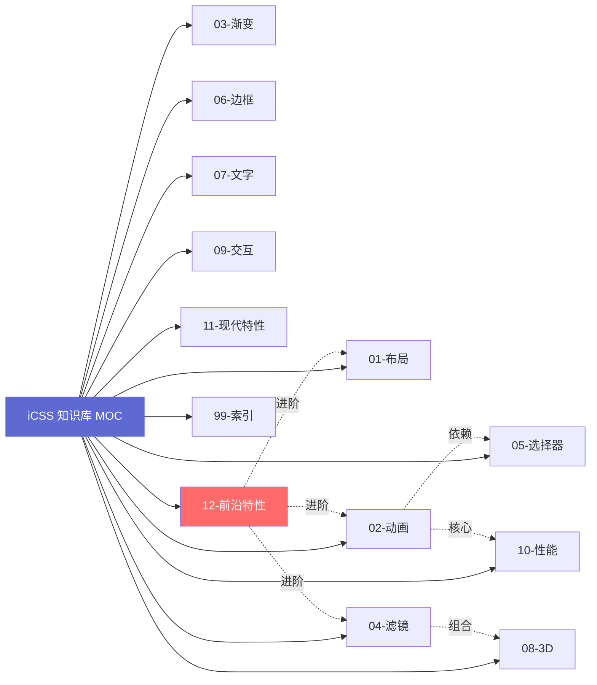
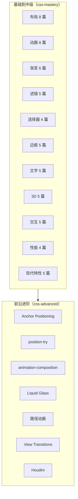

# 📚 iCSS 知识库 · Map of Content

> 本知识库基于 [chokcoco/iCSS](https://github.com/chokcoco/iCSS) GitHub 仓库 220+ 篇文章与 [coco1s 博客园](https://www.cnblogs.com/coco1s) 全部内容深度提炼，作为 agent 学习与记忆 CSS 前沿技巧的核心资源。
> 
> 所有笔记均使用 `[[]]` 双链互联，配合 YAML frontmatter 标签系统构建知识图谱。

## 🎯 核心原则

1. **原生优先**：CSS 可实现的绝不引入 JS，单标签可实现的不用多标签
2. **兼容兜底**：优先适配现代浏览器，新特性必带 `@supports` 降级方案
3. **性能至上**：动画仅用 `transform`/`opacity`，杜绝触发布局重排
4. **易维护**：全量使用 CSS 变量管理，零硬编码样式

## 🗺️ 知识图谱导航



## 📂 分类索引

### 基础到中级（对应 css-mastery）

| 分类 | MOC | 核心内容 |
|------|-----|----------|
| 01-布局 | [[00-MOC-布局\|布局 MOC]] | Flex/Grid/容器查询/锚点定位/1px 边框/Sticky |
| 02-动画 | [[00-MOC-动画\|动画 MOC]] | transition/keyframes/ScrollTimeline/单标签动画 |
| 03-渐变 | [[00-MOC-渐变\|渐变 MOC]] | linear/radial/conic-gradient/background-clip |
| 04-滤镜 | [[00-MOC-滤镜\|滤镜 MOC]] | filter/backdrop-filter/mix-blend-mode/SVG 滤镜 |
| 05-选择器 | [[00-MOC-选择器\|选择器 MOC]] | :has/:is/:where/:nth-child/@layer |
| 06-边框 | [[00-MOC-边框\|边框 MOC]] | clip-path/不规则边框/border-image/圆角 |
| 07-文字 | [[00-MOC-文字\|文字 MOC]] | 渐变文字/描边/打字机/溢出省略/可变字体 |
| 08-3D | [[00-MOC-3D\|3D MOC]] | perspective/preserve-3d/翻转卡片/立方体 |
| 09-交互 | [[00-MOC-交互\|交互 MOC]] | 纯 CSS 弹窗/下拉菜单/表单验证/鼠标跟随 |
| 10-性能 | [[00-MOC-性能\|性能 MOC]] | content-visibility/will-change/contain |
| 11-现代特性 | [[00-MOC-现代特性\|现代特性 MOC]] | CSS 嵌套/三角函数/容器查询单位/subgrid |

### 前沿进阶（对应 css-advanced）

| 分类 | MOC | 核心内容 |
|------|-----|----------|
| 12-前沿特性 | [[00-MOC-前沿特性\|前沿特性 MOC]] | Anchor/@position-try/animation-composition/Liquid Glass/View Transitions/Houdini |

### 工具索引

| 索引 | 内容 |
|------|------|
| [[标签索引]] | 全部标签按层级聚合 |
| [[兼容性总览]] | 各特性浏览器支持矩阵 + 降级方案 |
| [[速查表]] | 常见问题速查 |

## 🔍 快速入口

### 按场景查找

- **居中布局** → [[Flex-对齐与分布]] / [[Grid-二维布局]]
- **文字溢出省略** → [[文字溢出省略]]
- **毛玻璃效果** → [[backdrop-filter-毛玻璃]] / [[Liquid-Glass-液态玻璃]]
- **渐变文字** → [[background-clip-文字渐变]]
- **不规则边框** → [[clip-path-多边形]] / [[不规则边框-drop-shadow]]
- **滚动动画** → [[滚动驱动动画-ScrollTimeline]] / [[路径动画×滚动驱动]]
- **暗黑模式** → [[CSS变量复用动画函数]] / [[layer-层级管控]]
- **Tooltip/Popover** → [[Anchor-Positioning-锚点定位]] / [[position-try-智能边界]]
- **多动画合成** → [[animation-composition-动画合成]]
- **视图过渡** → [[View-Transitions-API]]

### 按浏览器特性查找

- Chrome 125+ 新特性 → [[Anchor-Positioning-锚点定位]]、[[position-try-智能边界]]
- Chrome 115+ 新特性 → [[滚动驱动动画-ScrollTimeline]]、[[View-Transitions-API]]
- Chrome 112+ 新特性 → [[animation-composition-动画合成]]
- 全浏览器兼容 → [[Flex-对齐与分布]]、[[文字溢出省略]]、[[filter-滤镜组合]]

## 📊 知识体系统计



## 🔄 自我进化机制

本知识库支持 agent 自我进化：

1. **遇到新问题** → 查阅对应分类 MOC → 应用技巧 → 记录新发现
2. **发现新特性** → 创建新笔记（含 frontmatter） → 在分类 MOC 中添加链接
3. **关联已有知识** → 通过 `[[]]` 双链连接 → 强化知识网络
4. **定期回顾** → 通过 [[标签索引]] 检视标签体系 → 优化分类

## 📝 笔记模板

创建新笔记时使用以下模板：

```markdown
---
title: 笔记标题
type: note/technique/case/principle
tags:
  - icss/分类/子分类
  - 难度/初级|中级|高级
  - 兼容性/现代|渐进|实验
created: YYYY-MM-DD
source: 原文链接
related:
  - "[[相关笔记1]]"
  - "[[相关笔记2]]"
---

# 笔记标题

## 问题/场景
描述解决的问题或应用场景

## 核心原理
简述 CSS 原理

## 实现方案
\`\`\`css
/* 代码示例 */
\`\`\`

## 执行步骤
1. 步骤一
2. 步骤二

## 兼容性
- Chrome: 版本+
- Firefox: 支持/实验性
- Safari: 支持/实验性

## 降级方案
\`\`\`css
@supports not (特性) {
  /* 降级 */
}
\`\`\`

## 相关链接
- [[相关笔记1]]
- [[相关笔记2]]
```

## 🌐 与全局技能的关系

| 资源 | 位置 | 用途 |
|------|------|------|
| css-mastery | `c:/Users/Administrator/.trae-cn/skills/css-mastery/` | 全局技能，11 大分类基础到中级 |
| css-advanced | `c:/Users/Administrator/.trae-cn/skills/css-advanced/` | 全局技能，前沿特性深度剖析 |
| **本知识库** | `当前工作目录/icss-vault/` | Obsidian 格式，支持双链与知识图谱 |

**已知问题**：全局 `css-mastery` 技能的 SKILL.md 中文件路径仍指向旧项目位置 `g:/user_wqj/...`，因 agent 无全局 skill 目录写入权限，需用户手动修正为 `c:/Users/Administrator/.trae-cn/skills/css-mastery/`。

---

**维护者**：agent 自主维护
**最后更新**：2026-07-04
